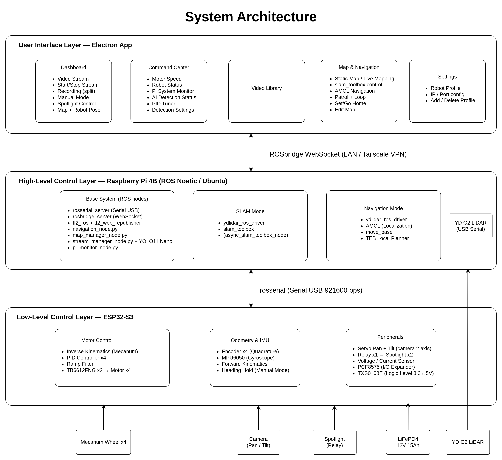
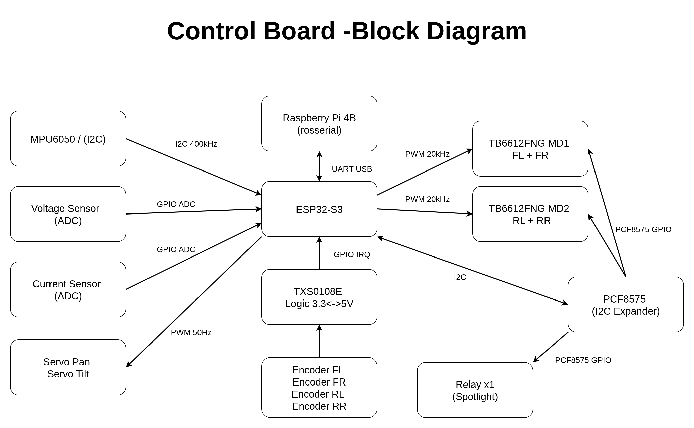
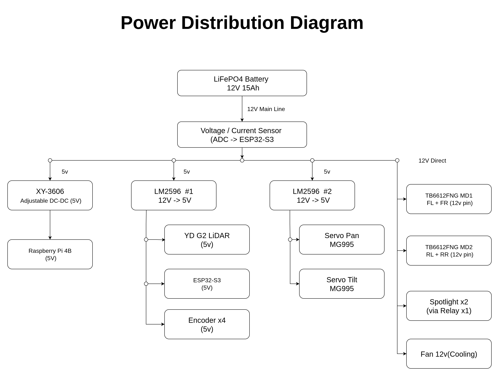
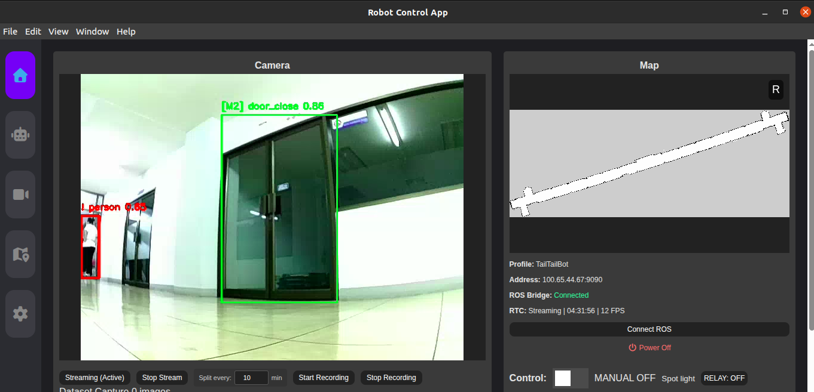
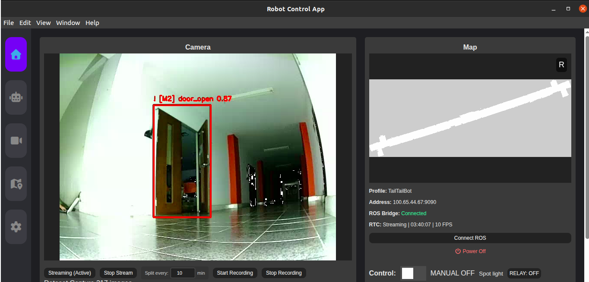
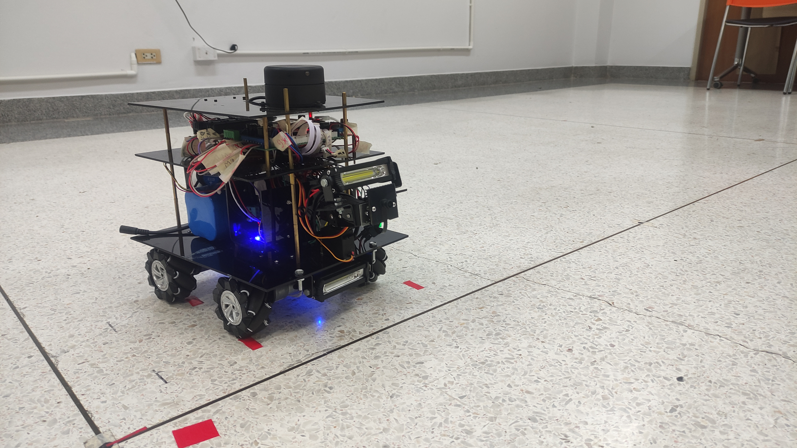

# ptR1 — Autonomous Indoor Patrol Robot

> Senior Year Thesis Project | Naresuan University | 2024–2026

ptR1 is an autonomous indoor patrol robot designed for long-corridor environments. It combines ROS-based navigation, real-time object detection, and a full-stack remote control application — all running on edge hardware.

---

## Features

- **Autonomous Navigation** — SLAM-based mapping (slam_toolbox) and path planning using AMCL and TEB Local Planner
- **Real-time Object Detection** — Person detection (COCO pretrained) and door state classification (custom-trained, mAP50 = 0.879) via YOLO11 nano + ONNX Runtime
- **4-Wheel Mecanum Drive (X-config)** — Omnidirectional movement with PID motor control
- **Remote Control App** — Electron-based dashboard with live video streaming (WebRTC/RTSP), map visualization, and navigation commands
- **Remote Access** — Tailscale VPN for out-of-network access

---

## System Architecture



The system is divided into 3 layers:

- **User Interface Layer** — Electron App (Dashboard, Command Center, Map & Navigation, Video Library, Settings) communicating via ROSbridge WebSocket over LAN or Tailscale VPN
- **High-Level Control Layer** — Raspberry Pi 4B running ROS Noetic, handling SLAM, localization, navigation, object detection, and video streaming
- **Low-Level Control Layer** — ESP32-S3 handling motor control (PID, Mecanum inverse kinematics), odometry, IMU, relay, and servo control via rosserial at 921600 bps

---

## Hardware

| Component | Spec |
|---|---|
| Main Computer | Raspberry Pi 4B (4GB RAM) |
| Microcontroller | ESP32-S3 |
| Drive System | 4-Wheel Mecanum (X-config) |
| Motor Driver | TB6612FNG x2 (FL+FR / RL+RR) |
| LiDAR | YDLidar G2 (USB Serial) |
| Camera | Fisheye USB Camera (Pan/Tilt, MG995 Servo x2) |
| IMU | MPU6050 (I2C 400kHz) |
| I/O Expander | PCF8575 (I2C) — Relay & Motor direction |
| Logic Level Shifter | TXS0108E (3.3V ↔ 5V) |
| Encoder | Quadrature Encoder x4 |
| Spotlight | COB LED x2 (via Relay) |
| Battery | LiFePO4 12V 15Ah |
| Power Regulation | LM2596 x2 (12V→5V), XY-3606 (12V→5V for Pi) |




---

## Software Stack

| Layer | Technology |
|---|---|
| Robot OS | ROS Noetic (Ubuntu 20.04) |
| SLAM | slam_toolbox (async) |
| Localization | AMCL |
| Local Planner | TEB Local Planner |
| Object Detection | YOLO11 nano + ONNX Runtime |
| Firmware | ESP32-S3 (Arduino / rosserial) |
| Control App | Electron + Node.js + WebRTC |

---

## Installation

### Prerequisites

- ROS Noetic on Ubuntu 20.04
- Python 3.8+
- Node.js 18+
- Electron

### ROS Setup (Raspberry Pi)

```bash
# Clone the repository
git clone https://github.com/leoss-wc/ptR1.git
cd ptR1

# Install ROS dependencies
rosdep install --from-paths src --ignore-src -r -y

# Build
catkin_make
source devel/setup.bash
```

### Launch Base System (Raspberry Pi)

```bash
roslaunch ptR1_navigation base_sysptR1.launch
```

This starts all core nodes: rosbridge, serial connection, TF publishers, map manager, navigation manager, stream manager, and system monitor.

---

## Usage

### 1. Create a Map (SLAM Mode)

```bash
# Start SLAM via ROS service
rosservice call /map_manager/start_slam

# Drive the robot around to build the map
# When done, save the map
rosservice call /map_manager/save_map "name: 'my_map'"

# Stop SLAM
rosservice call /map_manager/stop_processes
```

### 2. Start Navigation

```bash
# Step 1: Load a map (starts map_server)
rosservice call /map_manager/select_nav_map "name: 'my_map'"

# Step 2: Start AMCL + move_base
rosservice call /nav/start "restore_pose: true"
```

### 3. Send Navigation Goals

**Option A — Direct ROS service (Patrol mode)**
```bash
# Start patrol with waypoints and looping
rosservice call /nav/start_patrol "goals: [...], loop: true"

# Pause / Resume / Stop patrol
rosservice call /nav/pause_patrol
rosservice call /nav/resume_patrol
rosservice call /nav/stop_patrol
```

**Option B — Via Electron App**

Open the control app, place waypoints on the map, and use the patrol controls in the dashboard.

### 4. Home Position

```bash
# Set current position as home
rosservice call /nav/set_home "name: 'my_map'"

# Navigate back to home
rosservice call /nav/go_home "name: 'my_map'"
```

### Electron App (Operator PC)

```bash
cd ptR1-app
npm install
npm start
```


---

## Detection Models

| Model | Task | Dataset | Confidence | mAP50 |
|---|---|---|---|---|
| Model 1 | Person Detection | COCO (pretrained) | 0.45 | — |
| Model 2 | Door State (open/close) | Custom (1,197 images) | 0.30 | 0.879 |

---

## Screenshots

| Electron App — Person & Door Detection | Electron App — Door Open Detection |
|---|---|
|  |  |



---

## Known Limitations

- **Inference rate is low on Raspberry Pi 4B** — person detection runs every ~2.5s and door detection every ~6s due to CPU constraints. A GPU-equipped board (e.g. Jetson Nano) would enable real-time performance
- **Glass doors are invisible to LiDAR** — transparent surfaces cause gaps in the costmap, requiring manual waypoint placement near glass areas
- **AMCL localization drift** — long corridors with repeating door patterns can cause localization ambiguity over time
- **rosserial dependency** — requires stable USB connection; reconnection must be handled manually if disconnected

---

## Author

**Thirayut Wanchiang**
Computer Engineering, Naresuan University
[github.com/leoss-wc](https://github.com/leoss-wc) | thirayut.wc@gmail.com